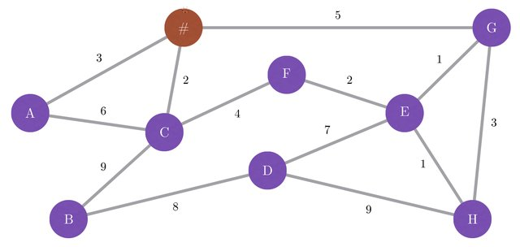
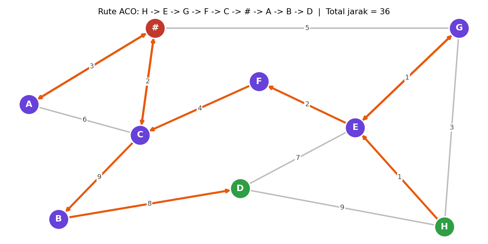

# Ant Colony Optimization untuk Traveling Salesman Problem (Gambar 1)

Tugas mata kuliah **Kecerdasan Buatan** — menyelesaikan *Traveling Salesman
Problem* (TSP) pada graph **Gambar 1** menggunakan algoritma **Ant Colony
Optimization (ACO)**.

> **Soal:** Cari rute dari **Point H** ke **Point D** yang **wajib melewati `#`**,
> dengan Ant Colony Optimization.



## Graph (Gambar 1)

**Simpul:** `#, A, B, C, D, E, F, G, H`

**Sisi & bobot:**

| Sisi | Bobot | | Sisi | Bobot |
|------|:-----:|-|------|:-----:|
| #–A | 3 | | D–E | 7 |
| #–C | 2 | | D–H | 9 |
| #–G | 5 | | E–F | 2 |
| A–C | 6 | | E–G | 1 |
| B–C | 9 | | E–H | 1 |
| B–D | 8 | | G–H | 3 |
| C–F | 4 | | | |

## Pendekatan

Soal meminta rute TSP dari **H** ke **D** (jalur terbuka / *open path*, titik awal
dan akhir tetap) yang mengunjungi seluruh titik — sehingga `#` pasti ikut dilewati.

Graph ini **sparse**: tidak semua titik terhubung langsung, dan beberapa titik
(A, B, F) hanya berderajat-2 sehingga memaksa 3 sisi bertemu di titik C. Akibatnya
*Hamiltonian path* langsung yang melewati setiap titik tepat sekali **tidak ada**.

Karena itu dipakai pendekatan standar TSP pada graph berbobot (sesuai paper rujukan):

1. **Hitung jarak terpendek antar semua pasang titik** dengan **Floyd–Warshall**
   (`graph.py`). Ini menghasilkan graph lengkap (metric closure).
2. **Jalankan ACO** pada matriks jarak tersebut untuk menemukan urutan kunjungan
   titik H → … → D dengan total jarak minimum (`aco.py`).
3. **Jabarkan kembali** rute menjadi jalur fisik edge-per-edge pada graph asli
   (fungsi `expand_tour`). Karena memakai metric closure, jalur fisik bisa
   melewati ulang titik penghubung — ini wajar dan tetap menghasilkan jarak minimum.

### Cara kerja ACO (ringkas)

- Setiap **semut** membangun rute dari H, memilih titik berikutnya secara
  probabilistik berdasarkan **feromon** (τ) dan **heuristik** (η = 1/jarak):

  P(u→v) ∝ τ(u,v)^α · η(u,v)^β

- Setelah semua semut selesai, feromon **menguap** (faktor ρ) lalu **diperkuat**
  pada sisi-sisi yang dilewati, berbanding terbalik dengan panjang rute
  (rute lebih pendek → deposit lebih besar). Rute terbaik global juga diperkuat
  (strategi *elitist*).

Parameter default (`ACOParams`): `n_ants=20`, `n_iterations=200`,
`alpha=1.0`, `beta=3.0`, `rho=0.5`, `Q=100`, `seed=42`.

## Hasil

```
Rute ACO (urutan titik): H -> E -> G -> F -> C -> # -> A -> B -> D
Total jarak             : 36
Jalur fisik (edge graph): H -> E -> G -> E -> F -> C -> # -> A -> # -> C -> B -> D
'#' dilewati             : YA

--- Verifikasi (brute force) ---
Total jarak optimal     : 36
Status hasil ACO        : OPTIMAL
```

ACO menemukan rute dengan total jarak **36**, yang **terbukti optimal**
(dicocokkan dengan pencarian eksak *brute force* atas seluruh 7! = 5.040
kemungkinan urutan titik perantara).



## Struktur Berkas

| Berkas | Keterangan |
|--------|------------|
| `graph.py` | Definisi graph, Floyd–Warshall, rekonstruksi jalur |
| `aco.py` | Implementasi ACO + verifikasi brute force (program utama) |
| `visualize.py` | Menggambar graph & rute terbaik → `hasil_rute.png` |
| `gambar1.jpg` | Soal (Gambar 1) |
| `requirements.txt` | Dependensi (matplotlib) |

## Cara Menjalankan

```bash
# (opsional) buat virtual environment
python -m venv .venv
.venv\Scripts\activate        # Windows
# source .venv/bin/activate   # Linux/Mac

# jalankan solver ACO
python aco.py

# (opsional) buat visualisasi rute
pip install -r requirements.txt
python visualize.py
```

## Referensi

- M. Dorigo & T. Stützle, *Ant Colony Optimization*, MIT Press.
- Paper tugas: *Solving Traveling Salesman Problem Using Ant Colony
  Optimization Algorithm*.
- Video referensi: *Ant Colony Optimization Using Python*
  (https://www.youtube.com/watch?v=EJKdmEbGre8).
